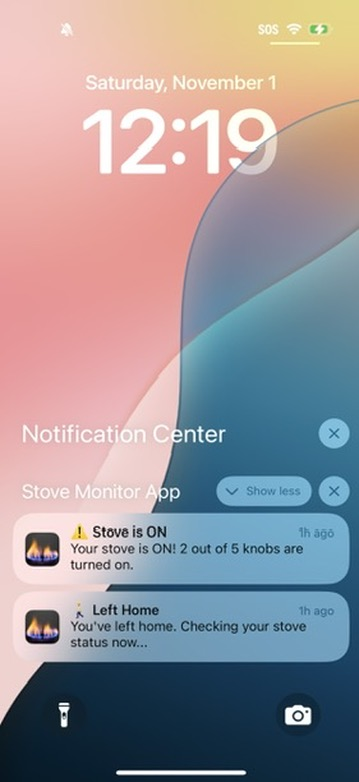
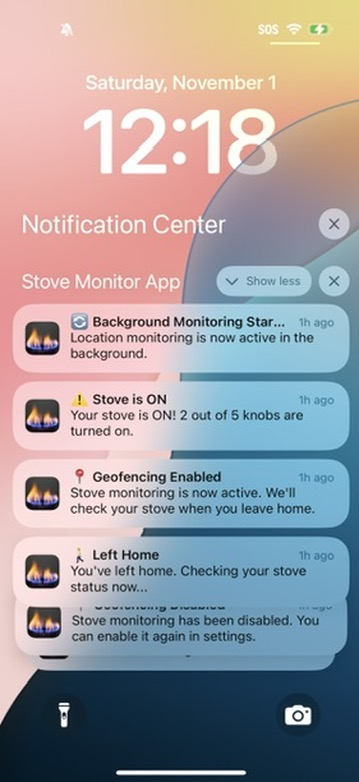
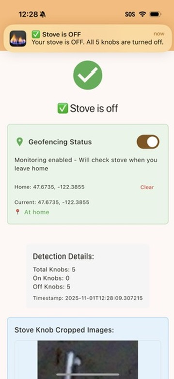
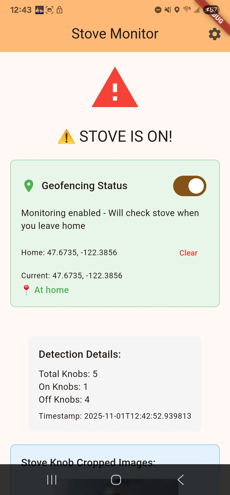
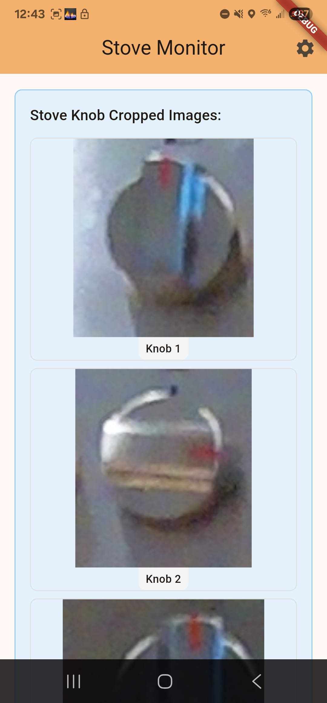

# Stove Monitor (mobile app)

StoveMonitor is a Flutter mobile app that can be used on iOS or android phones to automatically check your stove when you leave home using geofencing.
It is to be used in tandem with the server side implementation https://github.com/sgatuku/StoveMonitor which is an RPI zero with a camera pointed at your stove
that takes a photo and uses computer vision to determine if a stove burner is on/off using the knob positions. This mobile app makes HTTPs requests to the server
whenever the user has left home and notifies them via push notifications if a stove burner has been left on. 

## App Screenshots

Below are screenshots from both the ios and android app showings its features:

<p float="left">
  
  
  
  
  
</p>


## Features

- **Automatic Stove Monitoring**: Uses geofencing to automatically check stove status when you leave home
- **Real-time Detection**: Press a button to manually check if your stove is left on
- **Background Location Monitoring**: Works in the background to detect when you leave/return home
- **Push Notifications**: Get notified immediately if your stove is on when leaving home
- **Stove Status Detection**: Get instant feedback on stove knob positions with visual cropped images
- **Cross-platform**: Works on both Android and iOS

## Prerequisites

- Flutter SDK 3.5.4 or higher
- Dart 3.5.4 or higher
- A Raspberry Pi server running the stove detection API
- Cloudflare tunnel configured to expose your server
- Android Studio / Xcode (for native builds)

## Quick Start

### 0. Set Up Your Server

Download and run the server side implementation: https://github.com/sgatuku/StoveMonitor
Checkout the networking readme for help getting the internet routing setup so that this 
mobile app can access your server wherever in the world securely. 


### 1. Clone this Repository

```bash
git clone https://github.com/yourusername/StoveMonitorApp.git
cd StoveMonitorApp
```

### 2. Install Dependencies

```bash
flutter pub get
```

### 3. Configure Your Server Details

The app requires configuration to connect to your Raspberry Pi server. These settings are stored in a separate file to keep them secure.

**Create your configuration file:**

```bash
cp lib/config_local.dart.example lib/config_local.dart
```

**Edit `lib/config_local.dart`** with your actual values:

```dart
class AppConfig {
  // Your cloudflared domain URL
  static const String cloudflareUrl = 'https://your-domain.com';
  
  // Your API key from the server
  static const String apiKey = 'your-api-key-here';
  
  // Image path your server expects (if using file-based detection)
  static const String hardcodedImagePath = 'test/your-image.jpg';
  
  // Optional configuration
  static const int requestTimeoutSeconds = 30;
  static const bool enableVerboseLogging = false; // Set to false for production
}
```

> **Security Note**: The `config_local.dart` file is automatically ignored by git to prevent accidentally committing your sensitive keys.

### 4. Build and Run

#### For Android:

```bash
# Build APK
flutter build apk --release

# Or install directly on connected device
flutter install
```

#### For iOS:

```bash
# Open in Xcode
open ios/Runner.xcworkspace

# Build and run from Xcode, or use:
flutter build ios --release
```

#### For Development:

```bash
# Run on connected device
flutter run

# Run with hot reload
flutter run -d <device-id>
```

## Configuration

### Geofencing Setup

1. **Set Home Location**: When you first run the app, set your current location as home
2. **Enable Geofencing**: Toggle the geofencing switch to enable automatic monitoring
3. **Background Monitoring**: The app will monitor your location and check the stove when you leave

### Permissions Required

- **Location Permission**: Required for geofencing (foreground and background)
- **Notification Permission**: Required to receive stove alerts
- **Camera Permission**: Required for manual stove checks (handled by server)

### Home Radius

The default home radius is **0.2 miles** (approximately 320 meters). You can adjust this in `lib/services/location_utils.dart`:

```dart
static const double homeRadiusMiles = 0.2; // Change this value
```

## Project Structure

```
lib/
├── main.dart                      # Main app UI and entry point
├── config.dart                    # Template configuration (gitignored)
├── config_local.dart             # Your actual configuration (gitignored)
├── api/
│   └── rest_api.dart             # API client and data models
└── services/
    ├── background_location_service.dart  # Background location monitoring
    ├── geofencing_service.dart          # Geofencing logic
    ├── location_utils.dart              # Location utilities and calculations
    └── notification_service.dart        # Push notifications
```

## How It Works

### Automatic Monitoring Flow

1. **Set Home Location**: User sets their home location
2. **Enable Geofencing**: User enables automatic monitoring
3. **Background Monitoring**: App monitors location in the background
4. **Leave Detection**: When user leaves home (>0.2 miles away)
5. **Stove Check**: App automatically calls the detection API
6. **Notification**: User receives notification with stove status

### Manual Check Flow

1. **Press Button**: User presses "Check Stove Status"
2. **API Call**: App sends POST request to `/detect` endpoint with camera capture
3. **Server Processing**: Server captures image and analyzes stove knobs
4. **Response**: Server returns stove status with detailed information
5. **Display Results**: App shows whether stove is on or off with visuals

## Troubleshooting

### Connection Issues

- Verify your cloudflare domain URL is correct in `config_local.dart`
- Ensure the server is running and accessible
- Check firewall settings on both client and server
- Test the `/health` endpoint in a browser or with curl

### Authentication Errors

- Check your API key matches the server configuration
- Verify the `X-API-Key` header is being sent correctly
- See `AUTHENTICATION_STRATEGY.md` for authentication options

### Location Services Not Working

- Grant location permissions in device settings
- For Android, disable battery optimization for the app
- Check background location permissions are enabled
- On iOS, ensure "Always" location permission is granted

### Build Issues

```bash
# Clean build
flutter clean

# Reinstall dependencies
flutter pub get

# Update pods (iOS only)
cd ios && pod install && cd ..
```

## API Documentation

The app uses a REST API client defined in `lib/api/rest_api.dart`. Key endpoints:

- **Health Check**: `GET /health` - Verify server connectivity
- **Status**: `GET /status` - Get server configuration
- **Detect**: `POST /detect` - Main stove detection with camera capture

See the file for complete API documentation and data models.

## Dependencies

Key dependencies in `pubspec.yaml`:

- `http: ^1.1.0` - HTTP client for API calls
- `location: ^7.0.1` - Location services for geofencing
- `flutter_local_notifications: ^17.2.3` - Push notifications
- `path_provider: ^2.1.0` - File storage for persistent data

See `pubspec.yaml` for complete list.

## Platform-Specific Setup

### Android

1. **Battery Optimization**: Disable battery optimization for background location monitoring
2. **Background Location**: Grant "Allow all the time" permission for location
3. **Foreground Service**: The app runs a foreground service for background monitoring

### iOS

1. **Location Permission**: Grant "Always" permission for location services
2. **Background Modes**: Enable background location updates in Xcode capabilities
3. **Notifications**: Grant notification permissions on first launch


## License

This project is licensed under the MIT License - see [LICENSE](LICENSE) file for details.

## Security

- **API Keys**: Never commit your `config_local.dart` file
- **HTTPS**: Always use HTTPS for API communications (provided by Cloudflare)
- **Permissions**: Only request necessary permissions for the app to function
- **Background Data**: Location data is stored locally on device only
